

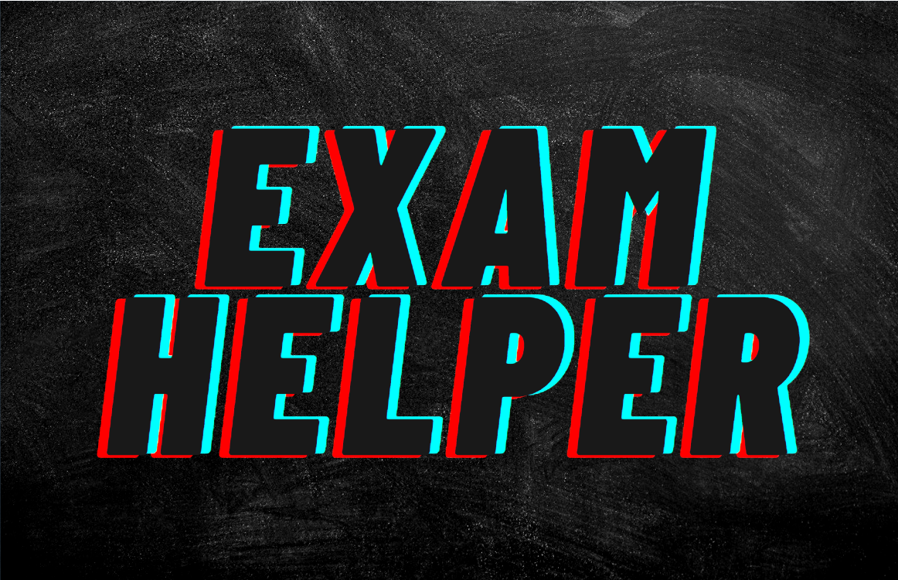

<h2 align="center"><i>Содержание</i></h2> 

- [Краткое описание](#descr)
- [Руководство пользователя](#manual)
  - [Интерфейс приложения](#interface)
  - [Вкладка "Тесты"](#tests)
  - [Вкладка "Поиск вопросов"](#search)
  - [Вкладка "Уведомления"](#notif)
  - [Вкладка "Настройки"](#settings)
- [Что дальше?](#next)

<a name="descr">## Краткое описание</a> 
Данная программа создавалась для студентов в качестве помощи при подготовке к экзаменам.
Автора попросили написать это приложение, поскольку существующие решения удобны, но доступны только для мобильных платформ,
либо неудобны вовсе. Автор ни в коем случае не дизайнер и обучался языку С++ самостоятельно. Данное приложение поддерживается,
дорабатывается и все просьбы заказчика (которым выступает друг автора), по возможности, выполняются. Приложение позволяет
проходить тесты по скачанным темам, искать вопросы по ключевому слову\фразе, ставить на вопросы уведомления и скачивать с
сайта тестування.укр базы тестов.

## Руководство пользователя
<h3 align="center"><i>Интерфейс приложения</i></h3>

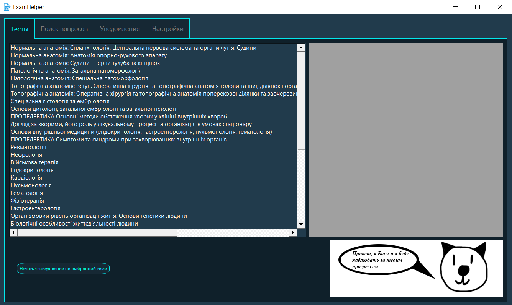

Приложение содержит в себе 4 вкладки, которые разделяют функционал программы:

* **Тесты**. На этой вкладке пользователь может проходить билеты тестов по доступным темам. Список в левой части экрана
содержит скачанные темы тестов, из вопросов которых будут составляться билеты. В серой части экрана с правой стороны 
открывается окно прохождение теста.
* **Поиск вопросов**. Если пользователю нужно найти определённый вопрос в определённой теме, то он может это сделать на
этой вкладке - выбирается тема, вводится ключевое слово или фраза и пользователь получает перечень подходящих под ключевую
фразу вопросов с правильными ответами.
* **Уведомления**. Во время прохождения билетов пользователь может наткнуться на неизвестный и\или интересный вопрос, над
которым стоит подумать! В таком случае пользователь может поставить на этот вопрос уведомление с временным промежутком, через
который пользователь сможет в текущей вкладке пройти интересующий вопрос ещё раз (аналог из реальной жизни - карточки, на которых
записывается важная информация и спустя некоторое время повторяется для лучшего усвоения материала).
* **Настройки**. Наверное, самая очевидная вкладка - позволяет пользователю настроить приложение под себя. Например, задать количество
вопросов в билете или скачать базу тестов с сайта и добавить её в приложение.

 
<h3 align="center"><i>Вкладка "Тесты"</i></h3>

На данной вкладке выполняется основная работа во всём приложении - прохождение тестов. Для начала прохождения следует из списка в левой 
части экрана выбрать тему, из вопросов которой будет составляться билет. После выбора темы необходимо нажать по кнопке "Начать тестирование
по выбранной теме". После выполнения предыдущих действий в правой части экрана появится окно с составленным билетом. Вопросы для билета беруться
случайные и шанс получить одинаковые билеты ничтожно мал. Прохождение теста выглядит следующим образом:

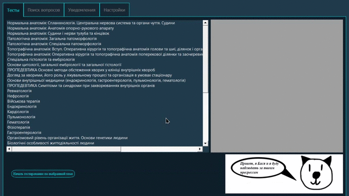

 
Окно тестов выглядит следующим образом:

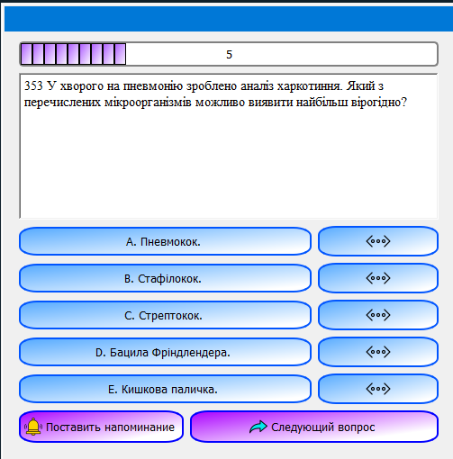

Окно с тестами содержит в себе следующие элементы:

- **Прогресс-бар**, который отображает прогресс прохождения текущего билета.
- **Текст вопроса**
- **Кнопки ответов вместе с кнопками расширения**. Кнопка расширения открывает окно с полным текстом ответа, если он слишком большой для размера
кнопки (в медицине попадаются крайне большие и страшные термины :( )
- **Кнопка уведомления**, которая открывает окно с выбором даты и времени уведомления
- **Кнопка перехода к следующему вопросу**

Окно выбора даты и времени позволяет выбрать дату (если это необходимо) в календаре, ввести вручную время. Однако, чаще всего
пользователи используют кнопки "Быстрого доступа" (шаблоны), которые отвечают за определённый временной промежуток. Через этот
промежуток уведомление станет доступным и во вкладке "Уведомления" пользователь сможет в очередной раз пройти выбранный вопрос.
Окно уведомления выглядит так:

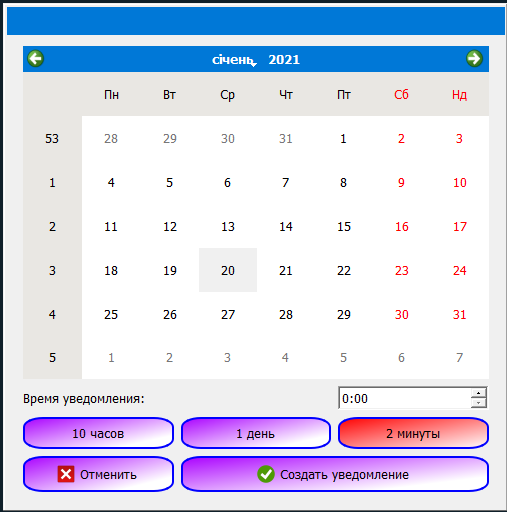

Окно результатов после окончания теста выглядит следующим образом:

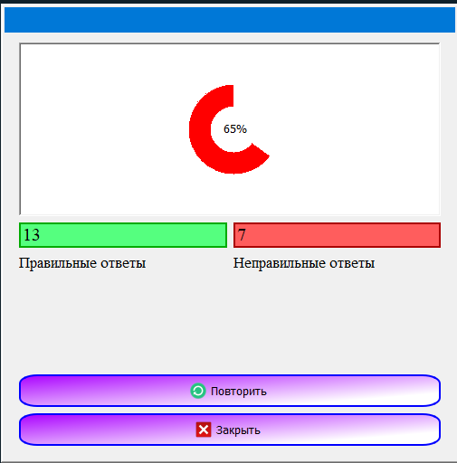

 
<h3 align="center"><i>Вкладка "Поиск вопросов"</i></h3>

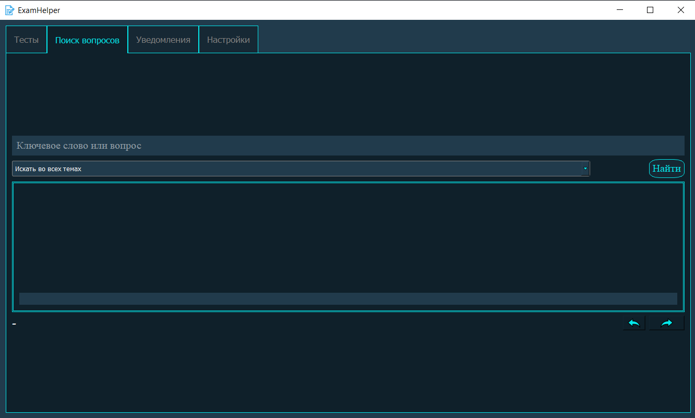

Если пользователю захотелось найти конкретный интересующий его вопрос и узнать правильный ответ - он может сделать это на текущей вкладке.
Вкладка включает следующие элементы интерфейса:

- **Строку для ввода ключевого слова или фразы**
- **Выпадающий список**, в котором выбирается тема, в которой программа будет вести поиск
- **Кнопка "Найти"**, после нажатия на которую выполняется поиск
- **Область вопроса**, на которую выводится текст вопроса и правильный ответ
- **Номер вопроса из выборки найденных**
- **Стрелки навигации по выборке найденных вопросов**

Алгоритм поиска вопроса следующий: вводится ключевое слово\фраза, выбирается тема (или все темы), нажимается кнопка "Найти". Это выглядит следующим
образом:

 
<h3 align="center"><i>Вкладка "Уведомления"</i></h3>

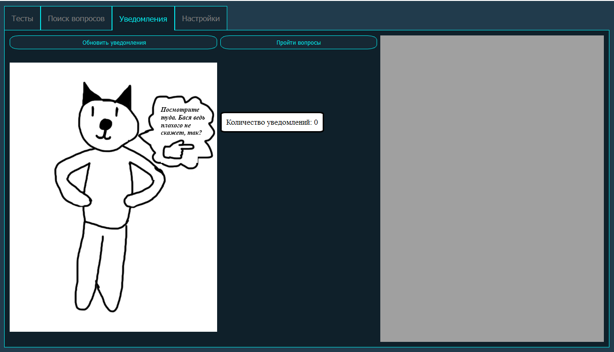

В этой вкладке содержится основная помощь в подготовке к экзаменам - бывают вопросы, ответы на которые ну никак не запоминаются :( 
Для того, чтоб исправить эту ситуацию и нужны уведомления! Во время прохождения билета пользователь ставит на любой интересующий вопрос
уведомление, например, на один день. Спустя сутки, заходя в программу и переключаясь на вкладку "Уведомления", пользователь видит, что
ему стали доступны для повторного прохождения вопросы, на которые уведомления и ставились. Таким образом, можно один и тот же вопрос 
проходить каждые, например, 5 часов и в конце ответ запомнится! Алгоритм работы с этой вкладкой следующий: проверятся поле "Количество
уведомлений". Если доступно более 0 уведомлений, то следует нажать кнопку "Пройти вопросы", после чего откроется билет, который
состоит из выбранных пользователем вопросов.  
Если после длительного использования программы зайти во вкладку "Уведомления", то она может сообщить, что доступно 0 уведомлений.
В таком случае следует нажать кнопку "Обновить уведомления", после чего новый, возможно доступные, уведомления появятся. Работа с этой вкладкой 
следующая:

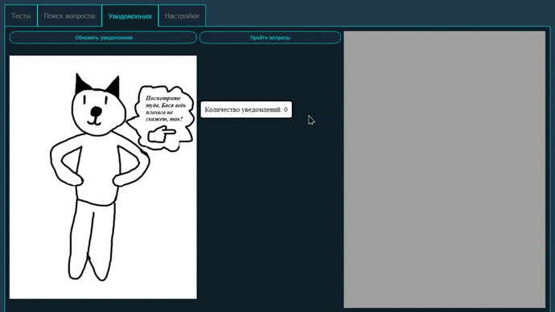

 
<h3 align="center"><i>Вкладка "Настройки"</i></h3>

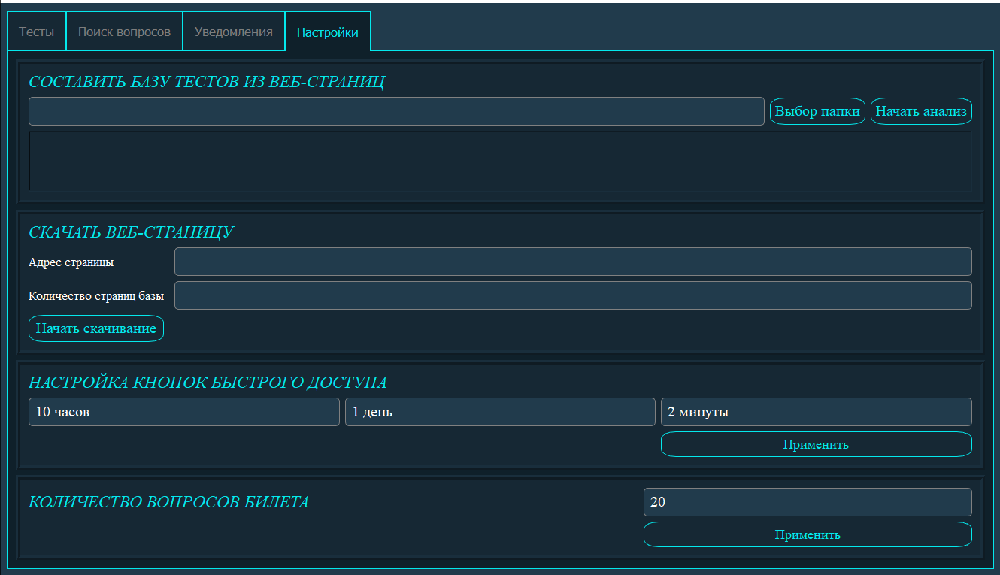

Если пользователю понадобится что-то настроить (а рано или поздно это случится), то он может сделать это в этой вкладке! Первым делом,
предоставляется возможность скачивать базы данных с сайта тестування.укр - необходимо перейти на указанный сайт, перейти на вкладку 
"Тести"->"Медичні тести". После этого выбирается нужная тема, напротив которой следует нажать кнопку "Переглянути базу тестів". 
Ссылку на открывшуюся страницу необходимо скопировать в настройки нашей программы в соответствующую графу. В графе ниже указывается
количество страниц базы тестов, которую необходимо скачать. Это будет выглядеть, приблизительно, так:

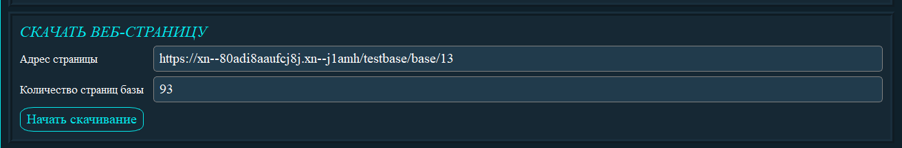

Далее необходимо нажать кнопку "Начать скачивание" и программа всё сделает за нас! Скачивание выполняется при помощи утилиты wget.
База веб-страниц составляется очень просто - необходимо указать путь к папке, куда наша программа скачала веб-страницы и нажать кнопку
"Начать анализ"
 
Под настройкой кнопок быстрого доступа имеется в виду указание для каждой кнопки временного интервала, после выбора которого будет
доступно уведомление на интересующий вопрос.
Последней настройкой является количество вопросов, которые содержит в себе билет.
 
## Что дальше?
Планируется смена дизайна программы, упрощение процесса обновления базы тестов программы и исправление ошибок! И, конечно же,
реализация того, что ещё пожелает заказчик данной программы. Кроме того, будет проведён рефакторинг кода
